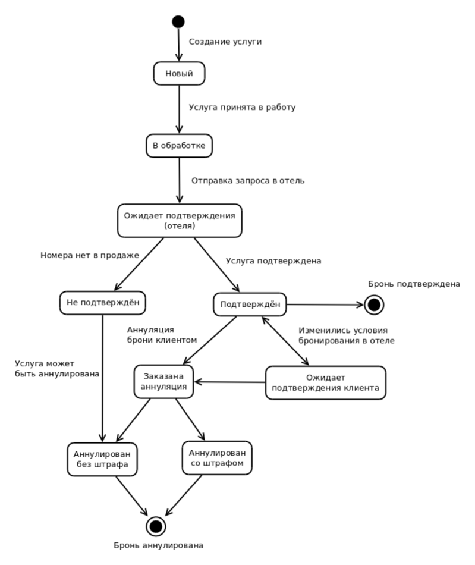

# Коннектор для SOAP-сервиса hotels-api.bronevik.com

- [Установка](#Установка)
    - [Требования](#Требования)
    - [Через Composer](#Через-composer)
    - [Без Composer](#Без-composer)
- [Подготовка](#Подготовка)
    - [Инициализация коннектора](#Инициализация-коннектора)
    - [Проверка подключения](#Проверка-подключения)
- [Документация по работе с SOAP-сервером (без использования этого коннектора)](#Документация-по-работе-с-soap-сервером-без-использования-этого-коннектора)
- [Документация по работе с клиентом и примеры](#Документация-по-работе-с-клиентом-и-примеры)
    - [Справочники](#Справочники)
        - [Получение списка стран](#Получение-списка-стран)
        - [Получение списка городов](#Получение-списка-городов)
        - [Получение списка удобств](#Получение-списка-удобств)
        - [Получение списка питания](#Получение-списка-питания)
    - [Поиск предложений отелей](#Поиск-предложений-отелей)
        - [Простой запрос](#Простой-запрос)
        - [Запрос с фильтрацией предложений](#Запрос-с-фильтрацией-предложений)
        - [Запрос предложений конкретного отеля](#Запрос-предложений-конкретного-отеля)
        - [Объект заказа](#Объект-заказа)
    - [Получение информации об отелях](#Получение-информации-об-отелях)
    - [Получение информации о предложении отеля](#Получение-информации-о-предложении-отеля)
    - [Заказ бронирования проживания и операции с заказами](#Заказ-бронирования-проживания-и-операции-с-заказами)
        - [Создание заказа](#Создание-заказа)
        - [Получение информации о заказе](#Получение-информации-о-заказе)
        - [Отмена (аннуляция) заказа](#Отмена-аннуляция-заказа)
        - [Статусы заказов](#Статусы-заказов)
    - [Бронирование онлайн и оффлайн](#Бронирование-онлайн-и-оффлайн)

## Установка

### Требования

PHP 5.6+

### Через Composer

Для установки через Composer необходимо добавить описание источника
в секцию `repositories` вашего `composer.json`. Примерный вид таков:

```json
{
    "require": {
        "bronevik/hotels-connector": "*@dev"
    },
    "repositories": [
        {
            "type": "vcs",
            "url": "https://github.com/bronevik-com/hotels-connector.git"
        }
    ]
}
```

### Без Composer

1. Склонируйте https://github.com/bronevik-com/hotels-connector.git
1. Зарегистрируйте автозагрузчик:

```php
<?php

spl_autoload_register(function ($class) {
    $file = ПУТЬ_К_ФАЙЛАМ_КОННЕКТОРА . '/src/' . strtr($class, ['Bronevik/HotelsConnector/' => '', '\\' => '/']) . '.php';
    if (is_readable($file)) {
        require_once $file;
    }
});
```

## Подготовка

### Инициализация коннектора

```php
<?php

use Bronevik\HotelsConnector;

$connector = new HotelsConnector(\Bronevik\HotelsConnector\Enum\Endpoints::DEVELOPMENT, true);
$connector->setCredentials('test', 'test', '123456');
$connector->setLanguage(\Bronevik\HotelsConnector\Enum\Languages::RUSSIAN);
```

В конструктор коннектора передаётся `endpoint` SOAP-сервера и флаг `debugMode`.

Для `endpoint` возможны два значения:

1. `\Bronevik\HotelsConnector\Enum\Endpoints::DEVELOPMENT` - для разработки, запросы отправляются на тестовый сервер.
1. `\Bronevik\HotelsConnector\Enum\Endpoints::PRODUCTION` - для использования в бою.

Флаг `debugMode`, установленный в `true`, позволяет использовать следующие методы:

1. `$connector->getLastResponse()` для получения содержимого последнего ответа сервера.
1. `$connector->getLastResponceHeaders()` для получения HTTP-заголовков последнего ответа сервера.

В метод `setCredentials()` передаются:

1. Логин вашей учётной записи bronevik.com.
2. Пароль от учётной записи bronevik.com
3. Ключ клиента. Для тестового сервера это '123456'. Для боевого сервера выдаётся только после заключения договора на
использование сервиса.

Метод `setLanguage()` принимает только `\Bronevik\HotelsConnector\Enum\Languages::RUSSIAN` или
`\Bronevik\HotelsConnector\Enum\Languages::ENGLISH`.

### Проверка подключения

Строка переданная в метод `ping()` будет отправлена сервером обратно.

```php
<?php

echo $connector->ping('Привет, Броневичок!'); // Привет, Броневичок!
```

## Документация по работе с SOAP-сервером (без использования этого коннектора)

Документация в формате PDF: https://hotels-api.bronevik.com/v2.0.1/api.pdf

Следует упомянуть, что при вызове метода `SearchHotelOffersRequest` параметр `currency` является обязательным и сейчас
у него только одно возможное значение: `rub`. Без заполнения этого параметра сервис вернёт сообщение об ошибке.

## Документация по работе с клиентом и примеры

### Справочники

#### Получение списка стран

Сейчас в справочнике есть только одна страна &mdash; Россия.

```php
<?php

/** @var \Bronevik\HotelsConnector\Element\Country[] $countries */
$countries = $connector->getCountries();
```
Разбор результата:
```php
<?php

/** @var \Bronevik\HotelsConnector\Element\Country $country */
foreach ($countries as $country) {
    $country->getId();   // 1
    $country->getCode(); // RUS
    $country->getName(); // Россия
}
```

#### Получение списка городов

В метод `getCities()` нужно передать Id страны.

```php
<?php

/** @var \Bronevik\HotelsConnector\Element\City[] $cities */
$cities = $connector->getCities(1);
```
Разбор результата:
```php
<?php

/** @var \Bronevik\HotelsConnector\Element\City $city */
foreach ($cities as $city) {
    $city->getId();         // 539
    $city->getName();       // Абаза
    $city->getRegionId();   // 102
    $city->getRegionName(); // Хакасия
    $city->getLatitude();   // 52.6439447
    $city->getLongitude();  // 90.1039492
}
```

#### Получение списка удобств
```php
<?php

/** @var \Bronevik\HotelsConnector\Element\City[] $cities */
$amenities = $connector->getAmenities();
```
Разбор результата:
```php
<?php

/** @var \Bronevik\HotelsConnector\Element\Amenity $amenity */
foreach ($amenities as $amenity) {
    $amenity->getId();
    $amenity->getName();
    $amenity->getGroupName();
}
```

#### Получение списка питания
```php
<?php

/** @var \Bronevik\HotelsConnector\Element\City[] $cities */
$meals = $connector->getMeals();
```
Разбор результата:
```php
<?php

/** @var \Bronevik\HotelsConnector\Element\Meal $meal*/
foreach ($meals as $meal) {
    $meal->getId();
    $meal->getName();
}
```

### Поиск предложений отелей

#### Простой запрос

```php
<?php

/** @var \Bronevik\HotelsConnector\Element\HotelWithOffers[] $hotelsWithOffers */
$hotelsWithOffers = $connector->searchHotelOffers(
    '2016-01-22', // дата заезда
    '2016-01-24', // дата выезда
    1             // Id города
);
```

#### Запрос с фильтрацией предложений

```php
<?php

// Массив фильтров
$criteria = [];

// Фильтр предложений по категории отеля (количеству звёзд)
$criterion = new \Bronevik\HotelsConnector\Element\SearchOfferCriterionHotelCategory;
$criterion->addCategory(4);
$criterion->addCategory(5);
$criteria[] = $criterion;

// Фильтр предложений по количеству гостей
$criterion = new \Bronevik\HotelsConnector\Element\SearchOfferCriterionNumberOfGuests;
$criterion->setAdults(2);
$criteria[] = $criterion;

// Фильтр предложений по возможности моментального подтверждения бронирования (онлайн)
$criterion  = new \Bronevik\HotelsConnector\Element\SearchOfferCriterionOnlyOnline;
$criteria[] = $criterion;

/** @var \Bronevik\HotelsConnector\Element\HotelWithOffers[] $hotelsWithOffers */
$hotelsWithOffers = $connector->searchHotelOffers(
    '2016-01-22', // дата заезда
    '2016-01-24', // дата выезда
    1,            // Id города
    $criteria     // массив фильтров
);
```

#### Запрос предложений конкретного отеля

```php
<?php

// Фильтр предложений по конкретному отелю
$criterion = new \Bronevik\HotelsConnector\Element\SearchOfferCriterionHotelName;
$criterion->setName('Атриум Палас Отель');

/** @var \Bronevik\HotelsConnector\Element\HotelWithOffers[] $hotelsWithOffers */
$hotelsWithOffers = $connector->searchHotelOffers(
    '2016-01-22', // дата заезда
    '2016-01-24', // дата выезда
    1,            // Id города
    [$criterion]  // массив фильтров
);
```

#### Отельное предложение

```php
<?php

/** @var \Bronevik\HotelsConnector\Element\HotelWithOffers $hotelWithOffers */
foreach ($hotelsWithOffers as $hotelWithOffers) {
    $hotelWithOffers->getId();               // 716
    $hotelWithOffers->getName();             // Октябрьская
    $hotelWithOffers->getAddress();          // ул. Софьи Ковалевской, 17
    $hotelWithOffers->getCategory();         // 4
    $hotelWithOffers->getCheckinTime();      // 12:00:00
    $hotelWithOffers->getCheckoutTime();     // 12:00:00
    $hotelWithOffers->getDescription();      // «Октябрьская» - гостиница четыре звезды, удобно расположена ... 
    $hotelWithOffers->getLatitude();         // 56.850036423348186
    $hotelWithOffers->getLongitude();        // 60.65261006355184
    $hotelWithOffers->getVATPercent();       // 18
    $hotelWithOffers->getDistanceToCenter(); // 2 (км)
    $hotelWithOffers->getVatApplicable();    // true
    $hotelWithOffers->getVatIncluded();      // false

	/** @var \Bronevik\HotelsConnector\Element\Image $photo */
    foreach ($hotelWithOffers->getPhotos() as $photo) {
        $photo->getGuid(); // 73c7c9b97a36ac0d970990937d842417
        $photo->getUrl();  // //dev.bronevik.com/static/photo/g/250x250a/73c7c9b97a36ac0d970990937d842417
    }

	/** @var \Bronevik\HotelsConnector\Element\HotelAmenity $amenity */
    foreach ($hotelWithOffers->getAmenities() as $amenity) {
        $amenity->getName(); // 
        $amenity->getType(); // 
    }
    
    /** @var \Bronevik\HotelsConnector\Element\AvailableAmenity $amenity */
    foreach ($hotelWithOffers->getAvailableAmenities() as $amenity) {
        $amenity->getId(); // 1
        $amenity->getIncluded(); // false
        $amenity->getPrice(); // 125.00 
    }

	/** @var \Bronevik\HotelsConnector\Element\HotelOffer $offer */
    foreach ($hotelWithOffers->getOffers() as $offer) {
        $offer->getCode();                  // T1I3MTYjI2RvdWJsZSMxMDY0IzIwMTYtMDEtMjIjMjAxNi0wMS0yNCMyLDE=
        $offer->getName();                  // Люкс
    
        $offer->getRoomType();              // double
        $offer->getRoomCapacity();          // 2

        $offer->getFreeRooms();             // 1
        $offer->getPrice();                 // 16000
        $offer->getCurrency();              // RUB
        $offer->getCommission();            // 0
        $offer->getImmediateConfirmation(); // true
        
        /**
          * Является ли предложение невозвратным 
          * 
          * @var boolean $isNonRefundable 
          */
        $isNonRefundable = $offer->getNonRefundable();
    
    	/** @var \Bronevik\HotelsConnector\Element\BreakfastInfo $offerBreafastInfo */
        $offerBreafastInfo = $offer->getBreakfastInfo();
        $offerBreafastInfo->getName();      // Завтрак шведский стол
        $offerBreafastInfo->getPrice();     // 0.00
        $offerBreafastInfo->getIncluded();  // true
        
        /**
          * Детализация стоимости 
          * 
          * @var \Bronevik\HotelsConnector\Element\PriceDetails $priceDetails
          */
        $priceDetails = $offer->getPriceDetails();
    
    	/** @var \Bronevik\HotelsConnector\Element\HotelOfferCancellationPolicy $cancellationPolicy */
        foreach ($offer->getCancellationPolicies() as $cancellationPolicy) {
            $cancellationPolicy->getPenaltyDateTime(); // 2016-01-21T10:00:00+05:00
            $cancellationPolicy->getPenaltySum();      // 8000
        }
        
        /** @var \Bronevik\HotelsConnector\Element\AvailableMeal $meal */
        foreach ($offer->getMeals() as $meal) {
            $meal->getId(); // 2
            $meal->getIncluded(); // true
            $meal->getPrice(); // 0.00
        }
        
        /** @var \Bronevik\HotelsConnector\Element\DailyPrice $dailyPrice */
        foreach ($offer->getDailyPrices() as $dailyPrice) {
            $dailyPrice->getDate(); // '2016-01-22'
            $dailyPrice->getPrice(); // 250.00
        }
    }
}
```

### Получение информации об отелях

Метод `getHotelInfo()` принимает массив идентификаторов отелей.

Возвращает те же данные, что и метод `searchHotelOffers()`, но без информации о предложениях.

```php
<?php

/** @var \Bronevik\HotelsConnector\Element\HotelWithInfo[] $hotelsWithInfo */
$hotelsWithInfo = $connector->getHotelInfo([716, 901]);
```

### Получение информации о предложении отеля

Метод `getHotelOffer()` принимает код предложения.

Возвращает те же данные, что и метод `searchHotelOffers()`.

```php
<?php

/** @var \Bronevik\HotelsConnector\Element\HotelOffer $offer */
$offer = $connector->getHotelOffer('T1I3MTYjI2RvdWJsZSMxMDY0IzIwMTYtMDEtMjIjMjAxNi0wMS0yNCMyLDE=');
```

### Заказ бронирования проживания и операции с заказами

#### Создание заказа

Заказ бронирования осуществляется на основе предложения `\Bronevik\HotelsConnector\Element\HotelOffer`. На каждый
бронируемый номер необходимо создать объект услуги проживания (`$accomodation`). Все объекты услуг добавляются в заказ.

В этом примере заказывается бронирование двух номеров для четырёх человек:

```php
<?php

/** @var \Bronevik\HotelsConnector\Element\HotelOffer $offer */
$offer = $connector->getHotelOffer('T1I3MTYjI2RvdWJsZSMxMDY0IzIwMTYtMDEtMjIjMjAxNi0wMS0yNCMyLDE=');

// Создание запроса на бронирование номеров
$orderRequest = new \Bronevik\HotelsConnector\Element\CreateOrderRequest;
$orderRequest->setContactPerson('Григорий');
$orderRequest->setContactEmail('grigoriy@example.com');
$orderRequest->setContactPhone('+79991234567');
$orderRequest->setComment('Гости приедут в районе 18 часов.');

// Создание услуг проживания и привязка их к заказу.
$accommodation = new \Bronevik\HotelsConnector\Element\ServiceAccommodation;
$accommodation->setOfferCode($offer->getCode());
$accommodation->setComment('Гостям потребуется высокоскоростное подключение к Интернет.');
$accommodation->addGuests('Валентин');
$accommodation->addGuests('Андрей');
$orderRequest->addServices($accommodation);

// Нужно создавать по услуге на каждый бронируемый номер.
$accommodation = new \Bronevik\HotelsConnector\Element\ServiceAccommodation;
$accommodation->setOfferCode($offer->getCode());
$accommodation->setComment('Не представлять напитки из минибара.');
$accommodation->addGuests('Николай');
$accommodation->addGuests('Эльдар');
$orderRequest->addServices($accommodation);

// Отправка заказа
/** @var \Bronevik\HotelsConnector\Element\Order $order */
$order = $connector->createOrder($orderRequest);
```

Разбор результата:

```php
<?php

$order->getId();            // 349007
$order->getComment();       // Гости приедут в районе 18 часов.
$order->getContactPerson(); // Григорий
$order->getContactPhone();  // +79991234567
$order->getContactEmail();  // grigoriy@example.com

/** @var \Bronevik\HotelsConnector\Element\OrderServiceAccommodation $service */
foreach ($order->getServices() as $service) {
    $service->getId();            // 917503
    $service->getNonRefundable(); // true
    $service->getComment();       // Не представлять напитки из минибара.
    $service->getCheckin();       // 2016-01-22T12:00:00+05:00
    $service->getCheckout();      // 2016-01-24T12:00:00+05:00
    $service->getCommission();    // 0
    $service->getDate();          // 2015-12-11T15:07:09+05:00
    $service->getHotelId();       // 716
    $service->getHotelName();     // Октябрьская
    $service->getOfferCode();     // T1I3MTYjI2RvdWJsZSMxMDY0IzIwMTYtMDEtMjIjMjAxNi0wMS0yNCMyLDE=
    $service->getOfferName();     // Люкс
    $service->getPrice();         // 16000
    $service->getReferenceId();   // 
    $service->getRoomType();      // double
    $service->getStatusId();      // 1
    $service->getStatusName();    // Новый

    /** @var \Bronevik\HotelsConnector\Element\HotelOfferCancellationPolicy $cancellationPolicy */
    foreach ($service->getCancellationPolicies() as $cancellationPolicy) {
        $cancellationPolicy->getPenaltyDateTime(); // 2016-01-21T10:00:00+05:00
        $cancellationPolicy->getPenaltySum();      // 8000
    }
    
    foreach ($service->getGuests() as $guest) {
        $guest; // Николай
    }
}
```

#### Получение информации о заказе

Метод `getOrder()` принимает Id заказа.

Возвращает те же данные, что и метод createOrder().

```php
<?php

/** @var \Bronevik\HotelsConnector\Element\Order $order */
$order = $connector->getOrder(349007);
```

#### Отмена (аннуляция) заказа

```php
<?php

/** @var bool $cancelResult */
$cancelResult = $connector->cancelOrder($order->getId());
```

#### Статусы заказов

| Id | Статус | Пояснение |
|---:|--------|-------------|
| 1  | новый | услуга только что создана |
| 2 | в обработке | сотрудник Bronevik.com принял услугу в работу |
| 3 | ожидает подтверждения | в отель отправлен запрос на бронирование |
| 4 | подтверждён | отель подтвердил борнь |
| 5 | не подтвержден | отель не подтвердил бронь |
| 6 | ожидает подтверждения клиента | изменились условия бронирования и стоимость брони |
| 7 | заказана аннуляция | клиент аннулировал услугу |
| 8 | ожидает аннуляции  | в отель отправлен запрос на аннуляцию |
| 9 | аннулировано, без штрафа | отель подтвердил аннуляцию без штрафа |
| 10 | аннулировано, штраф  | отель подтвердил аннуляцию со штрафом |

### Бронирование онлайн и оффлайн

Если бронируется предложение с немедленным подтверждением, то услуга сразу получит статус "подтверждён". В противном
случае бронь обрабатывается в режиме оффлайн по следующей схеме:


